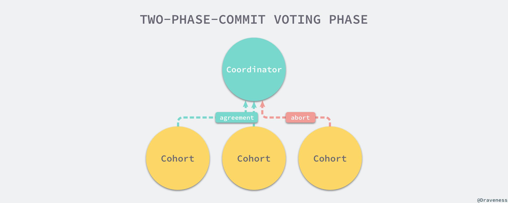
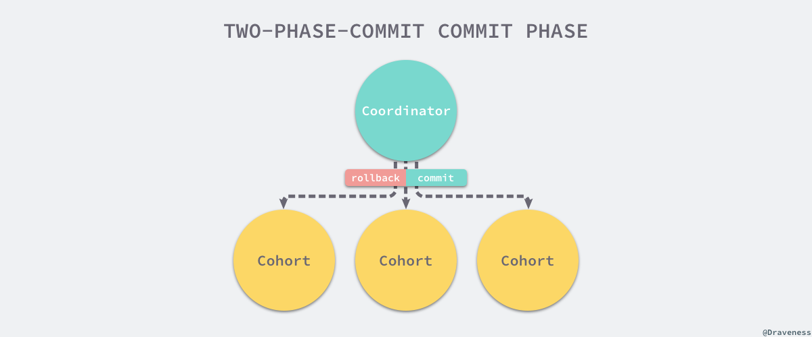
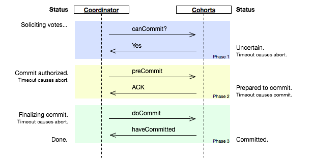

# [分布式事务](https://draveness.me/distributed-transaction-principle)

系统之间的通信可靠性从单一系统中的可靠变成了微服务架构之间的不可靠，分布式事务其实就是在不可靠的通信下实现事务的特性。**无论是事务还是分布式事务实现原子性都无法避免对持久存储的依赖**，事务使用磁盘上的日志记录执行的过程以及上下文，这样无论是需要回滚还是补偿都可以通过日志追溯，而分布式事务也会依赖 数据库、`Zookeeper` 或者 `ETCD` 等服务追踪事务的执行过程，总而言之，各种形式的日志是保证事务几大特性的 **重要** 手段。

## 2PC 与 3PC

## 2PC

两阶段提交的执行过程就跟它的名字一样分为两个阶段，**投票阶段和提交阶段**，在投票阶段中，协调者（`Coordinator`）会向事务的参与者（`Cohort`）询问是否可以执行操作的请求，并等待其他参与者的响应，参与者会执行相对应的事务操作并 **记录重做和回滚日志**，所有执行成功的参与者会向协调者发送 `AGREEMENT` 或者 `ABORT` 表示执行操作的结果。

当所有的参与者都返回了确定的结果（同意或者终止）时，两阶段提交就进入了提交阶段，协调者会根据投票阶段的返回情况向所有的参与者发送提交或者回滚的指令。

当事务的所有参与者都决定提交事务时，协调者会向参与者发送 `COMMIT` 请求，参与者在完成操作并释放资源之后向协调者返回完成消息，协调者在收到所有参与者的完成消息时会结束整个事务；与之相反，当有参与者决定 `ABORT` 当前事务时，协调者会向事务的参与者发送回滚请求，参与者会根据之前执行操作时的回滚日志对操作进行回滚并向协调者发送完成的消息，在提交阶段，无论当前事务被提交还是回滚，所有的资源都会被释放并且事务也一定会结束。

两阶段提交协议是一个阻塞协议，也就是说在两阶段提交的执行过程中，除此之外，如果事务的执行过程中协调者永久宕机，事务的一部分参与者将永远无法完成事务，它们会等待协调者发送 `COMMIT` 或者 `ROLLBACK` 消息，甚至会出现多个参与者状态不一致的问题。

### 3PC

为了解决两阶段提交在协议的一些问题，**三阶段提交引入了超时机制和准备阶段**，如果协调者或者参与者在规定的之间内没有接受到来自其他节点的响应，就会根据当前的状态选择提交或者终止整个事务，准备阶段的引入其实让事务的参与者有了除回滚之外的其他选择。

当参与者向协调者发送 `ACK` 后，如果长时间没有得到协调者的响应，在默认情况下，参与者会自动将超时的事务进行提交，不会像两阶段提交中被阻塞住；上述的图片非常清楚地说明了在不同阶段，协调者或者参与者的超时会造成什么样的行为。

## 消息服务

分布式事务带来复杂度的原因其实就是由于各个模块之间的通信不稳定，当我们发出一个网络请求时，可能的返回结果是成功、失败或者超时。

网络无论是返回成功还是失败其实都是一个确定的结果，当网络请求超时的时候其实非常不好处理，在这时调用方并不能确定这一次请求是否送达而且不会知道请求的结果，但是 **消息服务** 可以保证某条信息一定会送达到调用方；大多数消息服务都会提供两种不同的 `QoS` ，也就是服务的等级。

最常见的两种服务等级就是 `At-Most-Once` 和 `At-Least-Once` 。

  - `At-Most-Once`：能够保证发送方不对接收方是否能收到消息作保证，消息要么会被投递一次，要么不会被投递，这其实跟一次普通的网络请求没有太多的区别；
  - `At-Least-Once`：能够解决消息投递失败的问题，它要求发送者检查投递的结果，并在失败或者超时时重新对消息进行投递，发送者会持续对消息进行推送，直到接受者确认消息已经被收到

> 相比于 `At-Most-Once`，`At-Least-Once` 因为能够确保消息的投递会被更多人使用。

除了这两种常见的服务等级之外，还有另一种服务等级，也就是 `Exactly-Once`，这种服务等级不仅对发送者提出了要求，还对消费者提出了要求，它需要接受者对接收到的所有消息进行去重，发送者和接受者一方对消息进行重试，另一方对消息进行去重，两者分别部署在不同的节点上，这样对于各个节点上的服务来说，它们之间的通信就是 `Exactly-Once` 的，但是需要注意的是，`Exacly-Once` 一定需要接收方的参与。

使用消息服务实现分布式事务在底层的原理上与其他的方法没有太多的差别，只是 **消息服务能够帮助我们实现的消息的持久化以及重试等功能**，能够为我们提供一个比较合理的 API 接口，方便开发者使用。
